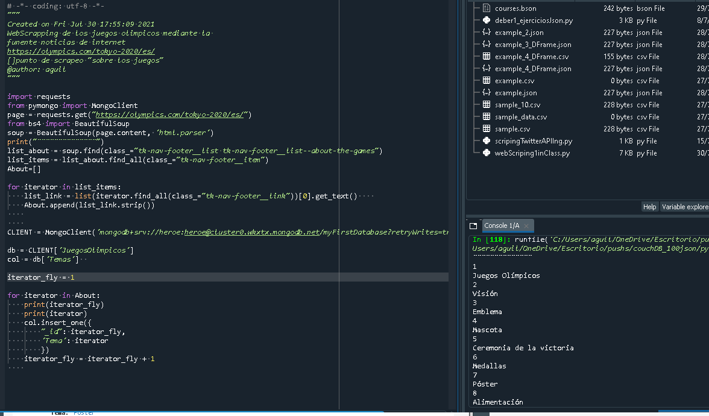
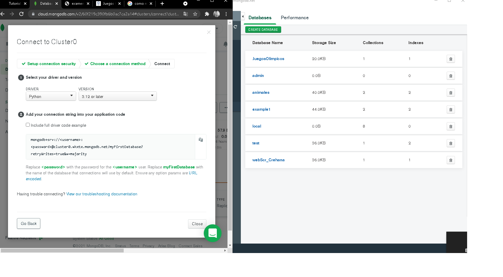
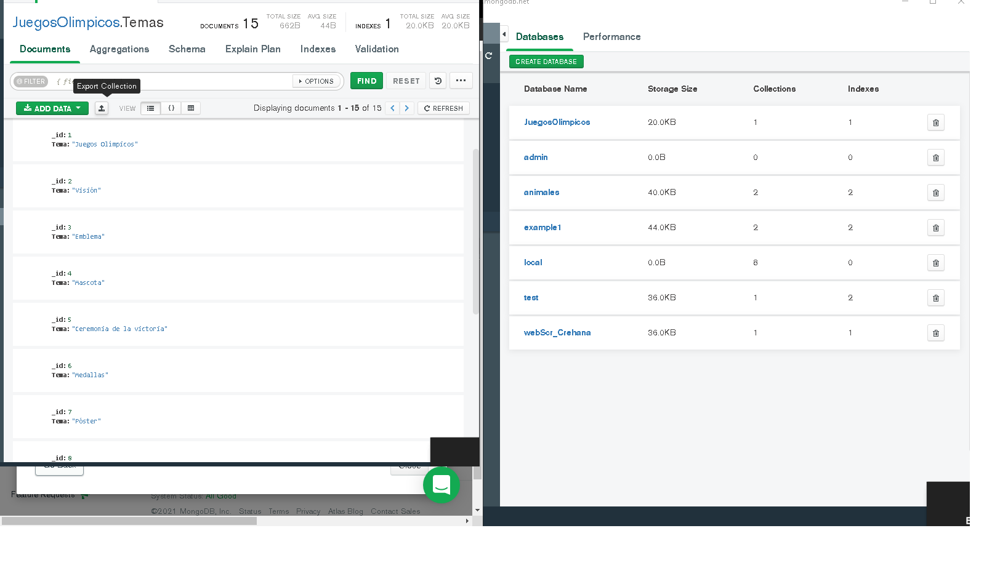

### Bienvenido al ejercicio donde veremos como hacer:
##### webScrapping mediante la web de los Juegos Olimpicos

```ruby
var1="Comenzemos"
var2="!"
print var1,var2
```

```python
print("1. Primero, Seleccionamos la pagina donde alojara nuestro Scrip para ello utilizamos de las librerias de mongodb, requests, soup, pandas y bson.

```
##### Aqui nos enfocamos mas en las etiquetas donde los metodos son manejados por Beatiful soup en su libreria solamente seleccionamos la etiqueta de la pagina y, como foco en la primera etiqueta que es donde saldran los childrens para obtener las demas etiquetas que sera de ayuda.Se los concatena, y mediante el for llamamos a cada instancia de la etiqueta para que se vaya seleccionando mediante el [0] para seleccionar las etiquetas consecuetivas



```html
<h5>Segundo. aplicamos el scrip y hacemos un cluster con atlas para permitir el direccionamiento remoto que existe estas tecnologias y la manera de hacerlo es con el usuario y contraseña generada por atlas por lo tanto esto nos permite mayor control de nuestros archivos remotamente desde cualquier lugar del globo terraqueo </h5>
```

```c++
#include <iostream>
int main () 
{
    std::cout << "Añadimos dicha conexion con atlas.";
    return 0;
}
```


```javascript
<HTML>
    <HEAD>
        <TITLE>EJE1.HTML</TITLE>
    </HEAD>
    <BODY>
        <SCRIPT LANGUAGE="JavaScript">
            alert("Por ultimo, verificamos en la base de datos.");
        </SCRIPT>
    </BODY>
</HTML>
```

<!-- /*
```php

<?php

echo "Existe algo curioso, que cuando se invirtio mucho tiempo en el Scrapeo de Facebook no retornada toda la secuenca entera de caracteres, pero, lo dejaremos para siguientes investigaciones.";

?>
```
*/-->
:racehorse:
